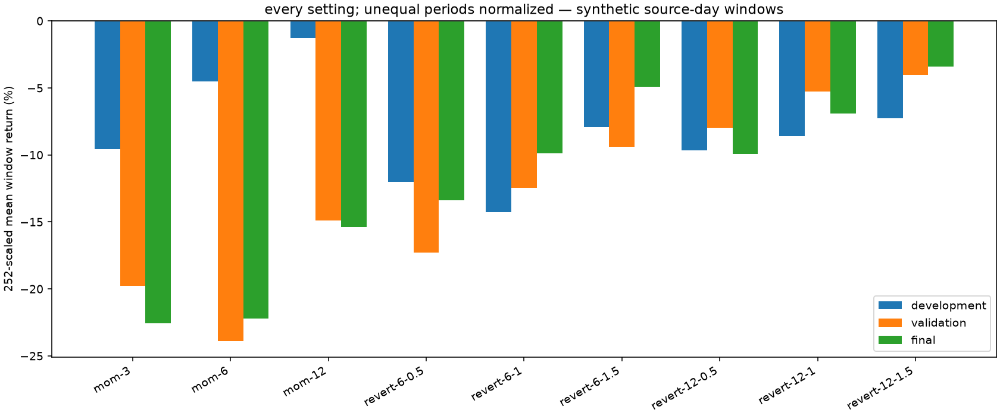
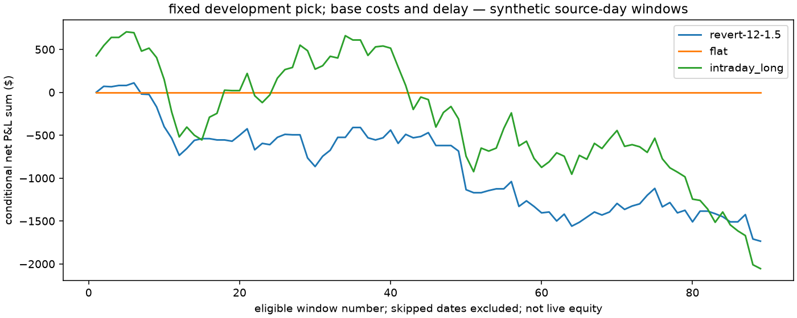
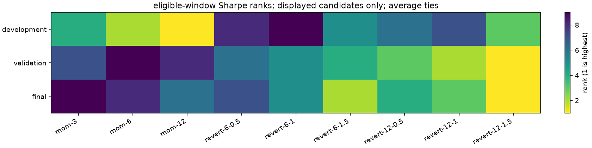

# YM

i kept the NQ development pick: `revert-12-1.5`. all 55 cases use this market's same complete-window mask. no later reselection.

these are made-up prices and software checks.

| part | complete / candidate weekdays | gross $ | net $ | mean $ / window | scaled annual mean | Sharpe | entries | exposure |
| --- | --- | ---: | ---: | ---: | ---: | ---: | ---: | ---: |
| development | 30 / 30 | -340.00 | -865.00 | -28.83 | -7.266% | -4.397 | 35 | 20.069% |
| validation | 29 / 30 | 165.00 | -465.00 | -16.03 | -4.041% | -2.027 | 42 | 22.342% |
| historical_final | 30 / 30 | 315.00 | -405.00 | -13.50 | -3.402% | -2.200 | 48 | 25.347% |

252 is a convention applied to eligible windows. scaled means aren't realized annual returns or CAGR. no skipped date is filled with zero. exposure is held minutes / observed window minutes. one full contract has different dollar risk across markets; $100,000 is a reporting convention, with no margin or equal-risk sizing claim.

## all base settings

| setting | dev net $ | val net $ | final net $ | dev Sharpe | val Sharpe | final Sharpe |
| --- | ---: | ---: | ---: | ---: | ---: | ---: |
| mom-3 | -1,140.00 | -2,275.00 | -2,685.00 | -4.731 | -9.029 | -14.804 |
| mom-6 | -535.00 | -2,750.00 | -2,645.00 | -2.387 | -11.326 | -10.787 |
| mom-12 | -150.00 | -1,715.00 | -1,830.00 | -0.559 | -9.198 | -9.102 |
| revert-6-0.5 | -1,430.00 | -1,990.00 | -1,595.00 | -5.994 | -8.135 | -9.295 |
| revert-6-1 | -1,700.00 | -1,435.00 | -1,175.00 | -7.868 | -6.417 | -6.684 |
| revert-6-1.5 | -945.00 | -1,080.00 | -585.00 | -4.852 | -5.176 | -3.590 |
| revert-12-0.5 | -1,150.00 | -920.00 | -1,180.00 | -5.055 | -3.672 | -5.741 |
| revert-12-1 | -1,025.00 | -605.00 | -820.00 | -5.108 | -2.495 | -4.603 |
| revert-12-1.5 | -865.00 | -465.00 | -405.00 | -4.397 | -2.027 | -2.200 |
| flat | 0.00 | 0.00 | 0.00 | n/a | n/a | n/a |
| intraday_long | 270.00 | -1,040.00 | -1,285.00 | 0.762 | -2.985 | -5.018 |

## did the gross winners survive costs?

| part | positive gross settings | positive after base costs | median scaled mean | pick rank among eligible settings |
| --- | ---: | ---: | ---: | ---: |
| development | 4 | 0 | -8.610% | 3 |
| validation | 3 | 0 | -12.470% | 1 |
| historical_final | 4 | 0 | -9.912% | 1 |

## costs and waiting

| part | scenario | comparison | net $ change from base | gross $ change | fill change |
| --- | --- | --- | ---: | ---: | ---: |
| development | gross_reference | cost only | 525.00 | 0.00 | 0 |
| development | cost_stress | cost only | -525.00 | 0.00 | 0 |
| development | delay_stress | delay only | -110.00 | -125.00 | -2 |
| development | combined_stress | combined cost and delay | -620.00 | -125.00 | -2 |
| validation | gross_reference | cost only | 630.00 | 0.00 | 0 |
| validation | cost_stress | cost only | -630.00 | 0.00 | 0 |
| validation | delay_stress | delay only | 265.00 | 250.00 | -2 |
| validation | combined_stress | combined cost and delay | -350.00 | 250.00 | -2 |
| historical_final | gross_reference | cost only | 720.00 | 0.00 | 0 |
| historical_final | cost_stress | cost only | -720.00 | 0.00 | 0 |
| historical_final | delay_stress | delay only | -675.00 | -720.00 | -6 |
| historical_final | combined_stress | combined cost and delay | -1,350.00 | -720.00 | -6 |

each cost-only comparison keeps delay fixed. delay-only keeps cost rates fixed; it changes entry and terminal execution. a better delayed result can happen by chance. these minute opens are assumed first-trade proxies, not quotes or guaranteed fills.

## later uncertainty

| part | pick minus baseline | block observations | paired windows | scaled mean difference | 95% interval |
| --- | --- | ---: | ---: | ---: | --- |
| validation | flat | 3 | 29 | too_few_days | |
| validation | flat | 5 | 29 | too_few_days | |
| validation | flat | 10 | 29 | too_few_days | |
| validation | intraday_long | 3 | 29 | too_few_days | |
| validation | intraday_long | 5 | 29 | too_few_days | |
| validation | intraday_long | 10 | 29 | too_few_days | |
| historical_final | flat | 3 | 30 | -3.402% | -9.626% to 3.953% |
| historical_final | flat | 5 | 30 | -3.402% | -9.787% to 3.530% |
| historical_final | flat | 10 | 30 | -3.402% | -9.834% to 4.547% |
| historical_final | intraday_long | 3 | 30 | 7.392% | -0.549% to 15.084% |
| historical_final | intraday_long | 5 | 30 | 7.392% | -0.401% to 15.342% |
| historical_final | intraday_long | 10 | 30 | 7.392% | -3.510% to 16.633% |

i use paired circular 3/5/10-observation blocks, 200 draws and seed 1729, with at least 30 paired windows. blocks follow ordered eligible observations, including calendar gaps. they don't restore missing days, correct selection or capture arbitrary long memory.

## same dates across markets

| part | common windows | pick net $ | pick Sharpe | intraday long net $ |
| --- | ---: | ---: | ---: | ---: |
| development | 30 | -865.00 | -4.397 | 270.00 |
| validation | 29 | -465.00 | -2.027 | -1,040.00 |
| historical_final | 30 | -405.00 | -2.200 | -1,285.00 |

the common population has 89 complete UTC dates in every included market. it is a separate coverage-conditioned comparison; the headline pick still comes from NQ's own development windows. [common outcomes](common-results.csv) retain all cases.

## yearly check of the fixed pick

| year | windows | pick net $ | pick Sharpe | intraday long net $ |
| --- | ---: | ---: | ---: | ---: |
| 2020 | 89 | -1,735.00 | -2.854 | -2,055.00 |

i don't execute a switching or newly reselected yearly portfolio.

protocol: `09d0b4e88f1c004a9e8be39eb874d41060e66ed302ba974289560d0533eaf57a`. semantic source: `0b7cb072464daaa38c2a4e15cfbd8f9df50b5302c47df2c6dc6182d875f7a0a3`. execution: `2388fc08aa461a7d0ce6b2a8cf61a7693e40e36a502852e76bf2de977c56e37f`. the manifest retains the input file hash separately.

[all outcomes](all-results.csv) · [every scenario's eligible-window P&L](daily-pnl-all-scenarios.csv) · [rank figure numbers](rank-chart-table.csv)
