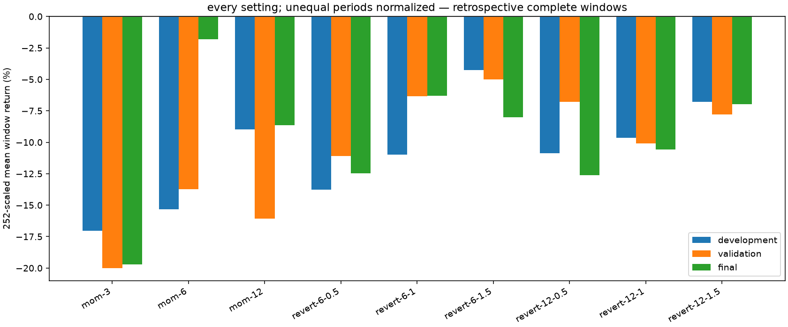
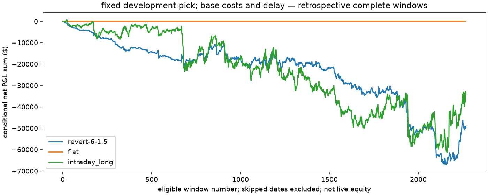
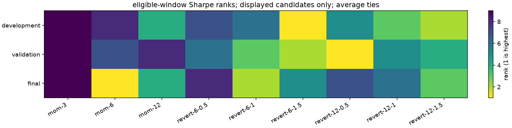

# NQ

i kept the NQ development pick: `revert-6-1.5`. all 55 cases use this market's same complete-window mask. no later reselection.

this is conditional historical P&L under the within-date source-rule inference, with unknown contract identity.

| part | complete / candidate weekdays | gross $ | net $ | mean $ / window | scaled annual mean | Sharpe | entries | exposure |
| --- | --- | ---: | ---: | ---: | ---: | ---: | ---: | ---: |
| development | 1122 / 1406 | 8,900.00 | -18,895.00 | -16.84 | -4.244% | -0.727 | 1853 | 16.009% |
| validation | 503 / 520 | 2,780.00 | -10,000.00 | -19.88 | -5.010% | -0.700 | 852 | 16.890% |
| historical_final | 642 / 680 | -5,250.00 | -20,460.00 | -31.87 | -8.031% | -0.699 | 1014 | 15.216% |

252 is a convention applied to eligible windows. scaled means aren't realized annual returns or CAGR. no skipped date is filled with zero. exposure is held minutes / observed window minutes. one full contract has different dollar risk across markets; $100,000 is a reporting convention, with no margin or equal-risk sizing claim.

## all base settings

| setting | dev net $ | val net $ | final net $ | dev Sharpe | val Sharpe | final Sharpe |
| --- | ---: | ---: | ---: | ---: | ---: | ---: |
| mom-3 | -75,850.00 | -39,935.00 | -50,175.00 | -2.730 | -2.119 | -1.186 |
| mom-6 | -68,315.00 | -27,435.00 | -4,610.00 | -2.375 | -1.407 | -0.109 |
| mom-12 | -39,985.00 | -32,110.00 | -22,010.00 | -1.415 | -1.664 | -0.589 |
| revert-6-0.5 | -61,235.00 | -22,130.00 | -31,805.00 | -1.909 | -1.146 | -0.915 |
| revert-6-1 | -48,905.00 | -12,670.00 | -16,090.00 | -1.658 | -0.717 | -0.499 |
| revert-6-1.5 | -18,895.00 | -10,000.00 | -20,460.00 | -0.727 | -0.700 | -0.699 |
| revert-12-0.5 | -48,415.00 | -13,515.00 | -32,100.00 | -1.514 | -0.690 | -0.914 |
| revert-12-1 | -43,015.00 | -20,145.00 | -26,920.00 | -1.409 | -1.111 | -0.801 |
| revert-12-1.5 | -30,260.00 | -15,570.00 | -17,810.00 | -1.125 | -0.957 | -0.564 |
| flat | 0.00 | 0.00 | 0.00 | n/a | n/a | n/a |
| intraday_long | -22,400.00 | -19,655.00 | 8,670.00 | -0.502 | -0.673 | 0.154 |

## what each completed trade earned

these are aggregate dollars divided by actual completed round trips, not averages of yearly ratios. frequency means entries or filled sides per eligible window; it isn't portfolio notional turnover.

| part | round trips | entries / window | fills / window | gross $ / trip | commission $ / trip | tick cost $ / trip | rounding $ / trip | net $ / trip |
| --- | ---: | ---: | ---: | ---: | ---: | ---: | ---: | ---: |
| development | 1,853 | 1.65 | 3.30 | 4.80 | 5.00 | 10.00 | 0.00 | -10.20 |
| validation | 852 | 1.69 | 3.39 | 3.26 | 5.00 | 10.00 | 0.00 | -11.74 |
| historical_final | 1,014 | 1.58 | 3.16 | -5.18 | 5.00 | 10.00 | 0.00 | -20.18 |

the recorded tick value is $5.00. base uses two $2.50 commissions and 2 adverse ticks per round trip: $15.00 before any rounding residual. the rounding column is recorded slippage minus that declared tick cost.

## all candidates per trade

each cell shows gross / total costs / net dollars per round trip. the adjacent frequency is completed trips per eligible window. totals and sample counts remain above.

| setting | dev gross / cost / net | dev trips / window | val gross / cost / net | val trips / window | final gross / cost / net | final trips / window |
| --- | ---: | ---: | ---: | ---: | ---: | ---: |
| mom-3 | 0.04 / 15.00 / -14.96 | 4.52 | -2.53 / 15.00 / -17.53 | 4.53 | -2.50 / 15.00 / -17.50 | 4.47 |
| mom-6 | -3.19 / 15.00 / -18.19 | 3.35 | -1.88 / 15.00 / -16.88 | 3.23 | 12.85 / 15.00 / -2.15 | 3.34 |
| mom-12 | 0.85 / 15.00 / -14.15 | 2.52 | -9.95 / 15.00 / -24.95 | 2.56 | 1.69 / 15.00 / -13.31 | 2.58 |
| revert-6-0.5 | -1.48 / 15.00 / -16.48 | 3.31 | 1.64 / 15.00 / -13.36 | 3.29 | -0.10 / 15.00 / -15.10 | 3.28 |
| revert-6-1 | -1.58 / 15.00 / -16.58 | 2.63 | 5.25 / 15.00 / -9.75 | 2.58 | 5.33 / 15.00 / -9.67 | 2.59 |
| revert-6-1.5 | 4.80 / 15.00 / -10.20 | 1.65 | 3.26 / 15.00 / -11.74 | 1.69 | -5.18 / 15.00 / -20.18 | 1.58 |
| revert-12-0.5 | -5.09 / 15.00 / -20.09 | 2.15 | 2.78 / 15.00 / -12.22 | 2.20 | -7.69 / 15.00 / -22.69 | 2.20 |
| revert-12-1 | -8.37 / 15.00 / -23.37 | 1.64 | -8.48 / 15.00 / -23.48 | 1.71 | -10.16 / 15.00 / -25.16 | 1.67 |
| revert-12-1.5 | -7.06 / 15.00 / -22.06 | 1.22 | -9.25 / 15.00 / -24.25 | 1.28 | -7.40 / 15.00 / -22.40 | 1.24 |

### baselines on the same windows

| setting | dev gross / cost / net | dev trips / window | val gross / cost / net | val trips / window | final gross / cost / net | final trips / window |
| --- | ---: | ---: | ---: | ---: | ---: | ---: |
| flat | n/a / n/a / n/a | 0.00 | n/a / n/a / n/a | 0.00 | n/a / n/a / n/a | 0.00 |
| intraday_long | -4.96 / 15.00 / -19.96 | 1.00 | -24.08 / 15.00 / -39.08 | 1.00 | 28.50 / 15.00 / 13.50 | 1.00 |

flat has no completed trades, so its per-trade ratios are undefined. missing, failed or inconsistent accounting also gives n/a; the diagnostic artifact records the reason.

## the pick versus intraday long

these differences use the same market's eligible windows: pick minus baseline. net difference equals gross difference minus the extra modelled costs. this is an accounting decomposition, not a claim about the cause of a market regime.

| part | pick trips / window | long trips / window | gross difference $ / window | cost difference $ / window | net difference $ / window |
| --- | ---: | ---: | ---: | ---: | ---: | ---: |
| development | 1.65 | 1.00 | 12.90 | 9.77 | 3.12 |
| validation | 1.69 | 1.00 | 29.60 | 10.41 | 19.19 |
| historical_final | 1.58 | 1.00 | -36.68 | 8.69 | -45.37 |

## the cost budget on the fixed paths

net at total cost C per round trip is G - R*C. break-even is G/R, the gross column above. a positive budget allows positive net only below that cost; a zero or negative budget allows none. a negative budget isn't an achievable fee reduction.

the circles start at zero cost, hollow circles mark positive break-even budgets, and diamonds show recorded base costs. these trades and timestamps stay fixed. this isn't an estimate of executable costs and doesn't change fill probabilities, spread, queueing or impact. delay changes can change the path and have separate saved economics.

[saved trade economics for every scenario and sample](../trade-economics.json). this is post-results descriptive arithmetic; the original evaluation identities stay unchanged.

## did the gross winners survive costs?

| part | positive gross settings | positive after base costs | median scaled mean | pick rank among eligible settings |
| --- | ---: | ---: | ---: | ---: |
| development | 3 | 0 | -10.874% | 1 |
| validation | 4 | 0 | -10.093% | 2 |
| historical_final | 3 | 0 | -8.639% | 5 |

## costs and waiting

| part | scenario | comparison | net $ change from base | gross $ change | fill change |
| --- | --- | --- | ---: | ---: | ---: |
| development | gross_reference | cost only | 27,795.00 | 0.00 | 0 |
| development | cost_stress | cost only | -27,795.00 | 0.00 | 0 |
| development | delay_stress | delay only | -4,970.00 | -5,720.00 | -100 |
| development | combined_stress | combined cost and delay | -32,015.00 | -5,720.00 | -100 |
| validation | gross_reference | cost only | 12,780.00 | 0.00 | 0 |
| validation | cost_stress | cost only | -12,780.00 | 0.00 | 0 |
| validation | delay_stress | delay only | -1,125.00 | -1,515.00 | -52 |
| validation | combined_stress | combined cost and delay | -13,515.00 | -1,515.00 | -52 |
| historical_final | gross_reference | cost only | 15,210.00 | 0.00 | 0 |
| historical_final | cost_stress | cost only | -15,210.00 | 0.00 | 0 |
| historical_final | delay_stress | delay only | 2,130.00 | 1,695.00 | -58 |
| historical_final | combined_stress | combined cost and delay | -12,645.00 | 1,695.00 | -58 |

each cost-only comparison keeps delay fixed. delay-only keeps cost rates fixed; it changes entry and terminal execution. a better delayed result can happen by chance. these minute opens are assumed first-trade proxies, not quotes or guaranteed fills.

## later uncertainty

| part | pick minus baseline | block observations | paired windows | scaled mean difference | 95% interval |
| --- | --- | ---: | ---: | ---: | --- |
| validation | flat | 3 | 503 | -5.010% | -15.233% to 5.058% |
| validation | flat | 5 | 503 | -5.010% | -14.658% to 3.983% |
| validation | flat | 10 | 503 | -5.010% | -14.224% to 4.281% |
| validation | intraday_long | 3 | 503 | 4.837% | -11.776% to 21.211% |
| validation | intraday_long | 5 | 503 | 4.837% | -11.143% to 21.279% |
| validation | intraday_long | 10 | 503 | 4.837% | -10.827% to 20.031% |
| historical_final | flat | 3 | 642 | -8.031% | -22.787% to 6.430% |
| historical_final | flat | 5 | 642 | -8.031% | -21.875% to 6.405% |
| historical_final | flat | 10 | 642 | -8.031% | -23.779% to 7.006% |
| historical_final | intraday_long | 3 | 642 | -11.434% | -33.765% to 10.255% |
| historical_final | intraday_long | 5 | 642 | -11.434% | -32.758% to 9.180% |
| historical_final | intraday_long | 10 | 642 | -11.434% | -30.586% to 10.284% |

i use paired circular 3/5/10-observation blocks, 2,000 draws and seed 1729, with at least 30 paired windows. blocks follow ordered eligible observations, including calendar gaps. they don't restore missing days, correct selection or capture arbitrary long memory.

## same dates across markets

| part | common windows | pick net $ | pick Sharpe | intraday long net $ |
| --- | ---: | ---: | ---: | ---: |
| development | 970 | -17,080.00 | -0.718 | -17,580.00 |
| validation | 467 | -9,385.00 | -0.720 | -14,370.00 |
| historical_final | 464 | -27,345.00 | -1.229 | -26,875.00 |

the common population has 1,901 complete UTC dates in every included market. it is a separate coverage-conditioned comparison; the headline pick still comes from NQ's own development windows. [common outcomes](common-results.csv) retain all cases.

## yearly check of the fixed pick

| year | windows | pick net $ | pick Sharpe | intraday long net $ |
| --- | ---: | ---: | ---: | ---: |
| 2016 (partial: 2016-08-12 to 2017-01-01, end exclusive) | 39 | -2,310.00 | -9.688 | -1,740.00 |
| 2017 | 117 | -2,615.00 | -4.613 | 500.00 |
| 2018 | 228 | -7,610.00 | -2.413 | -1,280.00 |
| 2019 | 244 | -5,615.00 | -1.659 | -1,685.00 |
| 2020 | 245 | 2,760.00 | 0.309 | -6,830.00 |
| 2021 | 249 | -3,505.00 | -0.520 | -11,365.00 |
| 2022 | 252 | -350.00 | -0.044 | -3,660.00 |
| 2023 | 251 | -9,650.00 | -1.525 | -15,995.00 |
| 2024 | 251 | -4,940.00 | -0.663 | 4,300.00 |
| 2025 | 244 | -28,950.00 | -2.219 | -19,485.00 |
| 2026 (partial: 2026-01-01 to 2026-08-10, end exclusive) | 147 | 13,430.00 | 1.746 | 23,855.00 |

partial labels describe the protocol's calendar span, not full observed coverage. profitable individual years remain visible; they don't replace the frozen split conclusion. i don't execute a switching or newly reselected yearly portfolio.

protocol: `71cbc574f4f600b13617517c5b6808fd43bcd2d80608cc4c17588156f827e522`. semantic source: `31730f2167fe84b8f8e8b5b729a9805062db7fd4f015d6ad02bc7af19566cfaf`. execution: `2354060058c8498ad69c397726d3d77068989c4f3a2a03df8d7cb42b93007edb`. the manifest retains the input file hash separately.

[all outcomes](all-results.csv) · [every scenario's eligible-window P&L](daily-pnl-all-scenarios.csv) · [rank figure numbers](rank-chart-table.csv)
