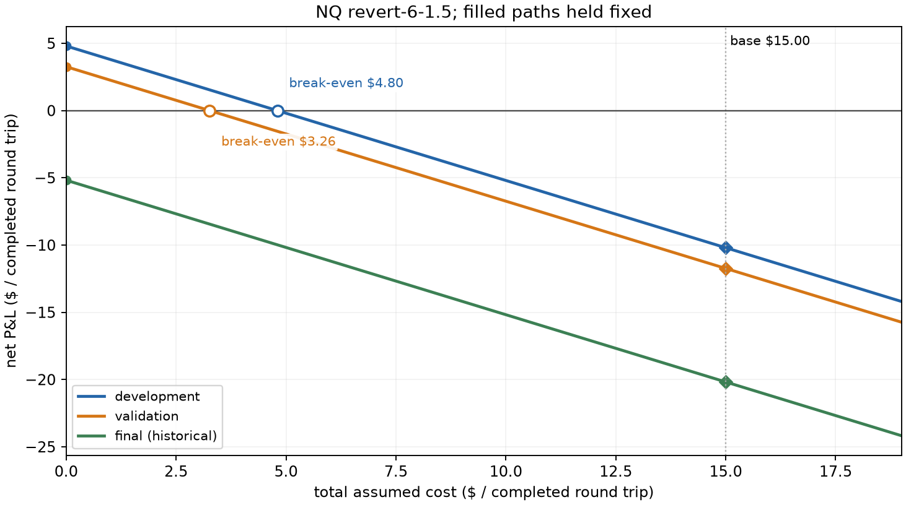

# why these rules failed

i tested whether a long/flat momentum or mean-reversion rule chosen on earlier NQ windows would keep a positive net edge on later dates and in ES/YM. this was a fixed candidate set, not a search for a profitable replacement.

i used complete 08:00–12:00 UTC weekday windows, five-minute signals, one full contract and daily resets. NQ had 1,122 / 503 / 642 eligible windows in development / validation / final. the declared 165 cases were nine signals plus two baselines, across five scenarios and three markets; they weren't 165 independent strategies.

## the gross gain was too small, then turned negative

the development choice was `revert-6-1.5`, the least-negative eligible Sharpe. it wasn't a recommendation to trade. i kept it unchanged in later dates and transfer checks.

| NQ part | completed trips | trips / window | gross $ / trip | base cost $ / trip | net $ / trip | total net $ |
| --- | ---: | ---: | ---: | ---: | ---: | ---: |
| development | 1,853 | 1.65 | 4.80 | 15.00 | -10.20 | -18,895 |
| validation | 852 | 1.69 | 3.26 | 15.00 | -11.74 | -10,000 |
| historical final | 1,014 | 1.58 | -5.18 | 15.00 | -20.18 | -20,460 |

the NQ tick value was $5. base cost was two $2.50 commissions plus two adverse ticks: $15 per completed trip. recorded rounding added nothing on these paths. even removing all assumed slippage would leave development at -$365 and validation at -$1,480 because commission alone exceeded gross gains. final gross P&L was already -$5,250.

trading frequency stayed around 1.6-1.7 trips per eligible window while gross gain per trip weakened. costs explain an exact subtraction, not every part of the loss. these aggregates don't identify a market-regime cause for the gross change.

gross-positive NQ candidates numbered 3, 4 and 3 across the splits; none survived base costs. some traded more than four times per eligible window. the [per-market tables](NQ/report.md) separate gross outcomes, frequency and costs for all nine rules, with baselines kept separate.

## the cost budget wasn't there

for the same filled path, net is G - R*C: gross dollars minus completed trips times total cost per trip. the selected rule's positive break-even budgets were only $4.80 and $3.26 in the first two splits, below even the $5 commission. the final gross budget was negative, so no nonnegative cost can make that path profitable.

this is post-results arithmetic, not another independent test or an estimate of actual execution costs. timestamps and trades stay fixed. it doesn't change fill probabilities, spread, queueing or impact; different delays have separate saved paths. [the diagnostic artifact](trade-economics.json) records all scenarios, samples, source files and original execution identities.

## the unchanged transfer checks also weakened

the same selected rule's gross dollars per trip were $3.21 / -$6.17 / -$1.25 on ES and $4.58 / -$8.25 / -$10.68 on YM. base costs were $30 per trip on ES and $15 on YM, derived from their recorded tick values. net was negative in every split. their own window counts and the separate common-date comparison remain in the [ES](ES/report.md) and [YM](YM/report.md) reports.

on NQ's final sample, intraday long earned $18,300 gross and $8,670 net with one trip per window. the selected rule earned -$5,250 gross and paid more total costs through extra trades. it lagged that baseline by $29,130 net. in development and validation it beat intraday long while both still lost against flat; relative improvement didn't create a positive net edge.

this wasn't a loss on every date or every year. NQ's selected rule made $2,760 net in 2020 and $13,430 in the partial 2026 slice, ending before 2026-08-10. i keep those years visible without choosing them to replace the frozen split conclusion.

## the research decision

the nine specified variants did not establish a positive net edge under this declared conditional study and execution model. i wouldn't claim a successful strategy from this candidate set. that doesn't prove all momentum or mean reversion fails, that the true expected advantage is exactly zero, or that future losses are inevitable. the project is a reusable research audit and a documented negative experiment.

of 36 declared later paired intervals on own complete dates, 24 include zero and 12 are wholly below it. none is wholly above. the 1,901 common-date check gives the same counts. these descriptive bootstrap intervals don't correct every selection, missingness or long-memory issue.

completeness is only known afterwards. minute opens and costs are assumptions, not measured executable fills. source-day continuity is inferred; real contract IDs remain unknown and the original roll-aware study remains blocked. fixed one-contract exposure isn't equal risk, and prior historical exposure makes the final period non-prospective. GC and CL remain descriptive. no reselected walk-forward portfolio was run.

raw empirical inputs stay local. anyone can regenerate these diagnostics from saved results and run the synthetic pipeline, but the synthetic example doesn't reproduce empirical strategy returns without licensed data. further research needs a separate frozen protocol and disclosure of these results as prior exposure.
