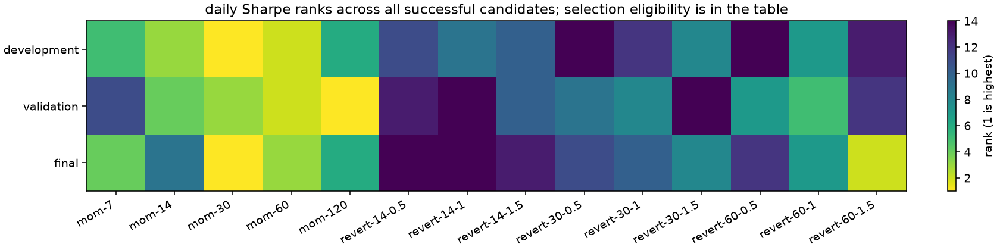

# BTC-USD

i ran 14 settings and two baselines across 6 scenarios on public spot bars. 0 of 96 runs failed. [every result](all-results.csv) stays in the report.

i kept the development pick from BTC-USD: `mom-30`. the later periods are historical checks, not untouched data.

## the three parts

| part | observed days / sessions | eligible settings | positive gross → positive net | pick: annual mean | median setting: annual mean | pick: Sharpe | pick rank | entries |
| --- | ---: | ---: | --- | ---: | ---: | ---: | ---: | ---: |
| development | 1826 | 14 | 7 → 6 | 1.224% | -0.043% | 0.956 | 1 | 65 |
| validation | 730 | 11 | 5 → 4 | 0.072% | -0.353% | 0.064 | 2 | 28 |
| historical_final | 974 | 14 | 10 → 8 | 1.794% | 0.308% | 0.674 | 1 | 53 |

annual mean is mean daily P&L / stated capital, scaled by the declared observations per year. it isn't CAGR. the median is across all successful candidates, including those below the selection trade threshold; it isn't a traded portfolio.

coverage: 2017-01-01T00:00:00+00:00 through 2026-08-31T00:00:00+00:00, 3,530 source bars; 0 missing days. period counts are above.

## all settings at base assumptions

| setting | development annual mean | validation annual mean | final annual mean |
| --- | ---: | ---: | ---: |
| mom-120 | 0.631% | 0.693% | 0.785% |
| mom-14 | 0.843% | 0.005% | 0.312% |
| mom-30 | 1.224% | 0.072% | 1.794% |
| mom-60 | 1.214% | 0.222% | 1.387% |
| mom-7 | 0.578% | -0.398% | 1.044% |
| revert-14-0.5 | -0.109% | -0.555% | -1.573% |
| revert-14-1 | -0.083% | -0.537% | -0.934% |
| revert-14-1.5 | -0.080% | -0.401% | -0.795% |
| revert-30-0.5 | -0.267% | -0.402% | -0.058% |
| revert-30-1 | -0.112% | -0.309% | -0.020% |
| revert-30-1.5 | -0.006% | -0.528% | 0.303% |
| revert-60-0.5 | -0.242% | -0.176% | -0.432% |
| revert-60-1 | 0.005% | -0.025% | 0.317% |
| revert-60-1.5 | -0.112% | -0.474% | 1.196% |
| flat | 0.000% | 0.000% | 0.000% |
| always_long | 0.904% | -0.196% | 1.359% |

## what changed under stress

| part | scenario | comparison | annual mean change from base | gross $ change | fill change |
| --- | --- | --- | ---: | ---: | ---: |
| development | gross_reference | cost only | 0.060% | 0.00 | 0 |
| development | higher_cost | cost only | -0.060% | 0.00 | 0 |
| development | two_days_late | delay only | -0.213% | -10,648.55 | 0 |
| development | three_days_late | delay only | -0.262% | -13,111.38 | 0 |
| development | combined_stress | combined cost and delay | -0.322% | -13,111.38 | 0 |
| validation | gross_reference | cost only | 0.109% | 0.00 | 0 |
| validation | higher_cost | cost only | -0.109% | 0.00 | 0 |
| validation | two_days_late | delay only | 0.201% | 4,016.61 | 0 |
| validation | three_days_late | delay only | 0.412% | 8,226.27 | 0 |
| validation | combined_stress | combined cost and delay | 0.303% | 8,226.27 | 0 |
| historical_final | gross_reference | cost only | 0.460% | 0.00 | 0 |
| historical_final | higher_cost | cost only | -0.460% | 0.00 | 0 |
| historical_final | two_days_late | delay only | -1.520% | -40,535.08 | 0 |
| historical_final | three_days_late | delay only | -0.217% | -5,767.71 | 0 |
| historical_final | combined_stress | combined cost and delay | -0.678% | -5,767.71 | 0 |

cost-only cases keep the delay fixed; delay-only cases keep cost rates fixed. delay can help by chance. these are assumed fills from OHLCV, not measured spreads or actual orders.

## how uncertain it is

| part | comparison | block length | annual mean difference | 95% interval |
| --- | --- | ---: | ---: | --- |
| validation | pick − flat | 3 | 0.072% | -1.486% to 1.645% |
| validation | pick − flat | 5 | 0.072% | -1.580% to 1.665% |
| validation | pick − flat | 10 | 0.072% | -1.689% to 1.717% |
| validation | pick − always_long | 3 | 0.268% | -1.354% to 1.869% |
| validation | pick − always_long | 5 | 0.268% | -1.318% to 1.946% |
| validation | pick − always_long | 10 | 0.268% | -1.361% to 1.953% |
| historical_final | pick − flat | 3 | 1.794% | -1.357% to 5.017% |
| historical_final | pick − flat | 5 | 1.794% | -1.293% to 4.909% |
| historical_final | pick − flat | 10 | 1.794% | -1.336% to 5.128% |
| historical_final | pick − always_long | 3 | 0.435% | -2.590% to 3.529% |
| historical_final | pick − always_long | 5 | 0.435% | -2.457% to 3.453% |
| historical_final | pick − always_long | 10 | 0.435% | -2.294% to 3.373% |

paired circular blocks keep the two strategies on the same days. i use the declared 3/5/10 lengths, 2,000 draws and seed 1729. these are descriptive intervals. serial dependence beyond those blocks, regime changes, prior knowledge and selection remain limits.

## rank changes and yearly selections

- development vs validation: Spearman 0.3272727272727273, on 11 settings eligible in both parts.
- development vs historical_final: Spearman 0.5604395604395604, on 14 settings eligible in both parts.

walk-forward below selects on the prior three calendar years. it inspects an already continuously simulated candidate in the next year. it doesn't execute a switching portfolio, charge switching costs or reset inventory at the year boundary.

| next year | selected setting | train Sharpe | next-year Sharpe | next-year days |
| --- | --- | ---: | ---: | ---: |
| 2020 | mom-14 | 0.617 | 3.467 | 366 |
| 2021 | mom-14 | 1.262 | 0.353 | 365 |
| 2022 | mom-30 | 1.144 | -1.787 | 365 |
| 2023 | mom-60 | 0.618 | 1.703 | 365 |
| 2024 | mom-60 | 0.651 | 1.005 | 366 |
| 2025 | mom-120 | 0.850 | -0.409 | 365 |
| 2026 | mom-30 | 1.047 | -0.381 | 243 |

## assumptions i kept

i used one BTC or one ETH, cash-funded, with $1m stated capital each and zero interest on spare cash. base costs are assumed 10 bps fee plus 5 bps slippage per side; higher cost doubles both. base orders wait one extra day after the completed daily bar. the two coins have different dollar risk; this isn't an equal-risk replication. final inventory is marked, not sold at an invented last price.

protocol: `8789728207a05be9c0419ec2792b04337fc8dbc3fac2ae705c767581ad3092f6`. source: `4bab0fac667351f73517e42e5d1d40e923467e544345636d7ebdb8ca72e272ff`.

execution: `a9632ef0f52627e53fa442bf970953cac5101f08349c33bf6bfccf7c08622976`. the saved manifest records code, actual callables, inputs and dependencies.

