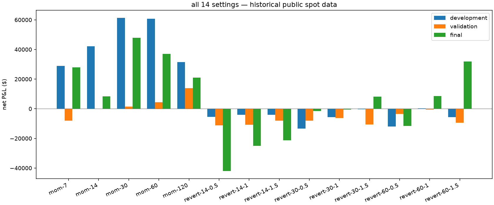
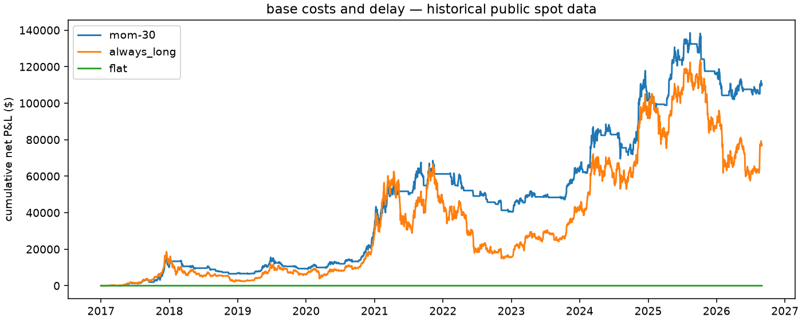

# BTC-USD audit

i ran 14 settings and two baselines across 6 cost and delay cases on historical public spot data. all 96 runs are in [the CSV](all-results.csv), including any failures.

this is a historical evaluation. the primary development pick stays fixed in later periods and other markets. it isn't an untouched holdout.

the development pick is `mom-30`.

| setting | development net $ | validation net $ | final net $ |
| --- | ---: | ---: | ---: |
| mom-7 | 28,924.74 | -7,955.80 | 27,850.75 |
| mom-14 | 42,187.70 | 106.51 | 8,336.71 |
| mom-30 | 61,248.26 | 1,440.44 | 47,883.82 |
| mom-60 | 60,754.87 | 4,443.73 | 37,023.95 |
| mom-120 | 31,547.14 | 13,853.34 | 20,947.04 |
| revert-14-0.5 | -5,468.84 | -11,104.39 | -41,972.00 |
| revert-14-1 | -4,174.36 | -10,733.79 | -24,936.87 |
| revert-14-1.5 | -4,011.16 | -8,013.13 | -21,202.76 |
| revert-30-0.5 | -13,334.16 | -8,034.56 | -1,551.45 |
| revert-30-1 | -5,625.19 | -6,171.49 | -523.05 |
| revert-30-1.5 | -290.18 | -10,568.59 | 8,077.01 |
| revert-60-0.5 | -12,086.90 | -3,522.61 | -11,517.54 |
| revert-60-1 | 254.50 | -502.56 | 8,464.20 |
| revert-60-1.5 | -5,618.85 | -9,488.21 | 31,919.90 |
| flat | 0.00 | 0.00 | 0.00 |
| always_long | 45,216.79 | -3,923.18 | 36,274.68 |

## costs and delay

| case | gross $ | net $ | fills |
| --- | ---: | ---: | ---: |
| gross_reference | 128,013.72 | 128,013.72 | 291 |
| base | 128,013.72 | 110,572.53 | 291 |
| higher_cost | 128,013.72 | 93,131.39 | 291 |
| two_days_late | 80,846.70 | 63,401.94 | 291 |
| three_days_late | 117,360.90 | 99,902.02 | 291 |
| combined_stress | 117,360.90 | 82,443.18 | 291 |

## later results against the baselines

| part | baseline | annual return difference | 95% bootstrap interval |
| --- | --- | ---: | --- |
| validation | flat | 0.07% | -1.49% to 1.65% |
| validation | flat | 0.07% | -1.58% to 1.67% |
| validation | flat | 0.07% | -1.69% to 1.72% |
| validation | always_long | 0.27% | -1.35% to 1.87% |
| validation | always_long | 0.27% | -1.32% to 1.95% |
| validation | always_long | 0.27% | -1.36% to 1.95% |
| historical_final | flat | 1.79% | -1.36% to 5.02% |
| historical_final | flat | 1.79% | -1.29% to 4.91% |
| historical_final | flat | 1.79% | -1.34% to 5.13% |
| historical_final | always_long | 0.44% | -2.59% to 3.53% |
| historical_final | always_long | 0.44% | -2.46% to 3.45% |
| historical_final | always_long | 0.44% | -2.29% to 3.37% |

i used paired circular blocks at the declared lengths, 2,000 bootstrap draws and seed 1729. the intervals depend on these days being a useful sample; they don't remove selection bias or predict future returns.

the JSON and CSV keep gross/net P&L, return on stated capital, daily volatility and Sharpe, daily drawdown, hourly exposure, fills, costs, years and splits. prices are marked at the end; an open position isn't forced closed just to improve a result.

