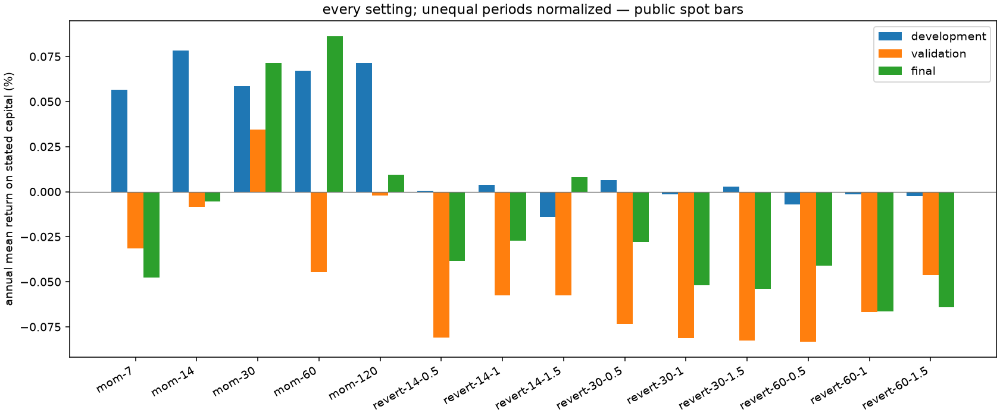
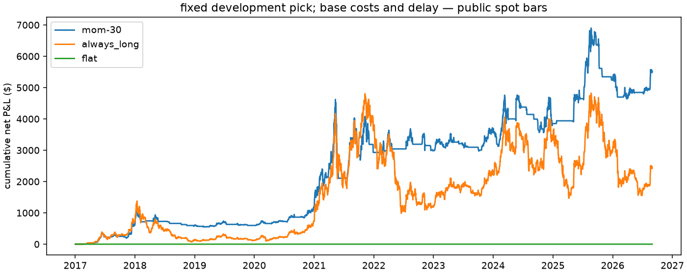
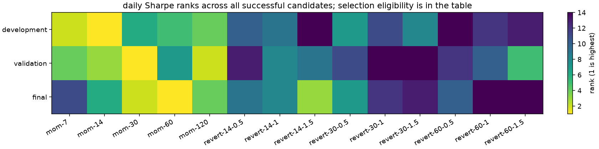

# ETH-USD

i ran 14 settings and two baselines across 6 scenarios on public spot bars. 0 of 96 runs failed. [every result](all-results.csv) stays in the report.

i kept the development pick from BTC-USD: `mom-30`. the later periods are historical checks, not untouched data.

## the three parts

| part | observed days / sessions | eligible settings | positive gross → positive net | pick: annual mean | median setting: annual mean | pick: Sharpe | pick rank | entries |
| --- | ---: | ---: | --- | ---: | ---: | ---: | ---: | ---: |
| development | 1826 | 14 | 10 → 9 | 0.059% | 0.003% | 0.499 | 5 | 55 |
| validation | 730 | 10 | 3 → 1 | 0.034% | -0.058% | 0.386 | 1 | 30 |
| historical_final | 974 | 12 | 5 → 4 | 0.071% | -0.033% | 0.489 | 2 | 36 |

annual mean is mean daily P&L / stated capital, scaled by the declared observations per year. it isn't CAGR. the median is across all successful candidates, including those below the selection trade threshold; it isn't a traded portfolio.

coverage: 2017-01-01T00:00:00+00:00 through 2026-08-31T00:00:00+00:00, 3,530 source bars; 0 missing days. period counts are above.

## all settings at base assumptions

| setting | development annual mean | validation annual mean | final annual mean |
| --- | ---: | ---: | ---: |
| mom-120 | 0.071% | -0.002% | 0.010% |
| mom-14 | 0.078% | -0.009% | -0.005% |
| mom-30 | 0.059% | 0.034% | 0.071% |
| mom-60 | 0.067% | -0.045% | 0.086% |
| mom-7 | 0.057% | -0.031% | -0.048% |
| revert-14-0.5 | 0.000% | -0.081% | -0.039% |
| revert-14-1 | 0.004% | -0.057% | -0.027% |
| revert-14-1.5 | -0.014% | -0.058% | 0.008% |
| revert-30-0.5 | 0.007% | -0.073% | -0.028% |
| revert-30-1 | -0.002% | -0.081% | -0.052% |
| revert-30-1.5 | 0.003% | -0.082% | -0.054% |
| revert-60-0.5 | -0.007% | -0.083% | -0.041% |
| revert-60-1 | -0.001% | -0.067% | -0.066% |
| revert-60-1.5 | -0.002% | -0.046% | -0.064% |
| flat | 0.000% | 0.000% | 0.000% |
| always_long | 0.073% | -0.070% | 0.007% |

## what changed under stress

| part | scenario | comparison | annual mean change from base | gross $ change | fill change |
| --- | --- | --- | ---: | ---: | ---: |
| development | gross_reference | cost only | 0.002% | 0.00 | 0 |
| development | higher_cost | cost only | -0.002% | 0.00 | 0 |
| development | two_days_late | delay only | 0.008% | 413.36 | 0 |
| development | three_days_late | delay only | 0.043% | 2,159.53 | 0 |
| development | combined_stress | combined cost and delay | 0.041% | 2,159.53 | 0 |
| validation | gross_reference | cost only | 0.008% | 0.00 | 0 |
| validation | higher_cost | cost only | -0.008% | 0.00 | 0 |
| validation | two_days_late | delay only | -0.037% | -736.65 | 0 |
| validation | three_days_late | delay only | -0.041% | -812.77 | 0 |
| validation | combined_stress | combined cost and delay | -0.049% | -812.77 | 0 |
| historical_final | gross_reference | cost only | 0.011% | 0.00 | 0 |
| historical_final | higher_cost | cost only | -0.011% | 0.00 | 0 |
| historical_final | two_days_late | delay only | 0.023% | 626.61 | 0 |
| historical_final | three_days_late | delay only | -0.023% | -599.85 | 0 |
| historical_final | combined_stress | combined cost and delay | -0.034% | -599.85 | 0 |

cost-only cases keep the delay fixed; delay-only cases keep cost rates fixed. delay can help by chance. these are assumed fills from OHLCV, not measured spreads or actual orders.

## how uncertain it is

| part | comparison | block length | annual mean difference | 95% interval |
| --- | --- | ---: | ---: | --- |
| validation | pick − flat | 3 | 0.034% | -0.079% to 0.147% |
| validation | pick − flat | 5 | 0.034% | -0.077% to 0.142% |
| validation | pick − flat | 10 | 0.034% | -0.076% to 0.140% |
| validation | pick − always_long | 3 | 0.104% | -0.045% to 0.255% |
| validation | pick − always_long | 5 | 0.104% | -0.051% to 0.265% |
| validation | pick − always_long | 10 | 0.104% | -0.051% to 0.267% |
| historical_final | pick − flat | 3 | 0.071% | -0.106% to 0.250% |
| historical_final | pick − flat | 5 | 0.071% | -0.105% to 0.252% |
| historical_final | pick − flat | 10 | 0.071% | -0.105% to 0.251% |
| historical_final | pick − always_long | 3 | 0.065% | -0.097% to 0.228% |
| historical_final | pick − always_long | 5 | 0.065% | -0.089% to 0.223% |
| historical_final | pick − always_long | 10 | 0.065% | -0.080% to 0.216% |

paired circular blocks keep the two strategies on the same days. i use the declared 3/5/10 lengths, 2,000 draws and seed 1729. these are descriptive intervals. serial dependence beyond those blocks, regime changes, prior knowledge and selection remain limits.

## rank changes and yearly selections

- development vs validation: Spearman 0.6848484848484848, on 10 settings eligible in both parts.
- development vs historical_final: Spearman 0.25874125874125875, on 12 settings eligible in both parts.

walk-forward below selects on the prior three calendar years. it inspects an already continuously simulated candidate in the next year. it doesn't execute a switching portfolio, charge switching costs or reset inventory at the year boundary.

| next year | selected setting | train Sharpe | next-year Sharpe | next-year days |
| --- | --- | ---: | ---: | ---: |
| 2020 | mom-30 | 0.525 | 2.226 | 366 |
| 2021 | mom-30 | 0.515 | 0.691 | 365 |
| 2022 | mom-14 | 0.980 | -0.489 | 365 |
| 2023 | mom-14 | 0.756 | 0.458 | 365 |
| 2024 | mom-14 | 0.681 | 0.287 | 366 |
| 2025 | mom-120 | 0.268 | -0.373 | 365 |
| 2026 | mom-60 | 0.761 | -0.409 | 243 |

## assumptions i kept

i used one BTC or one ETH, cash-funded, with $1m stated capital each and zero interest on spare cash. base costs are assumed 10 bps fee plus 5 bps slippage per side; higher cost doubles both. base orders wait one extra day after the completed daily bar. the two coins have different dollar risk; this isn't an equal-risk replication. final inventory is marked, not sold at an invented last price.

protocol: `8789728207a05be9c0419ec2792b04337fc8dbc3fac2ae705c767581ad3092f6`. source: `d268c8ec8a1e08a3e3ea6c9378d2cf6b174852af1671e302b5a0ac2de72ade36`.

execution: `97953f8084a72bd69f0e35ea367aab432aa5e75b81f0d5a3d34dfceb0f8e0383`. the saved manifest records code, actual callables, inputs and dependencies.

