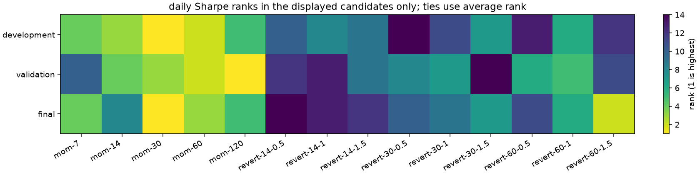
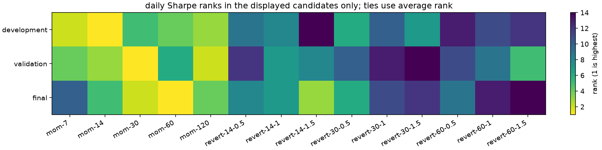

# corrected rank figures

i found that the original figures counted always-long in the ranks but hid it from the picture. these replacements rank only the 14 displayed signal settings. the saved selection and P&L are unchanged. i kept the original figures as historical artifacts.

BTC momentum-7 is rank 4 in development; ETH momentum-30 is rank 5. ties use average rank. the CSV next to each figure keeps its exact numbers.

