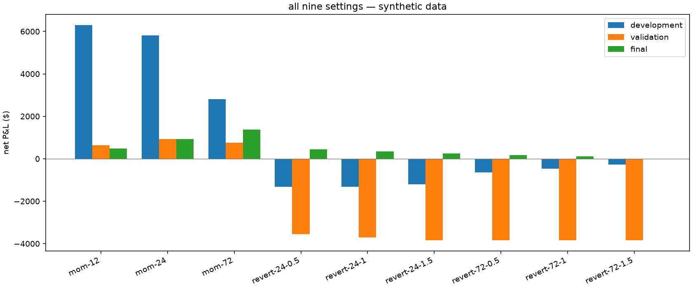
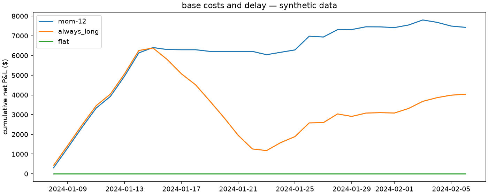

# SYN audit

i ran nine settings and two baselines across four cost and delay cases on synthetic data. all 44 runs are in [the CSV](all-results.csv), including any failures.

these prices are made up. this checks the software, not whether a market has an edge.

the development pick is `mom-12`.

| setting | development net $ | validation net $ | final net $ |
| --- | ---: | ---: | ---: |
| mom-12 | 6,291.63 | 645.95 | 488.89 |
| mom-24 | 5,806.99 | 920.81 | 932.97 |
| mom-72 | 2,812.57 | 762.59 | 1,382.76 |
| revert-24-0.5 | -1,318.55 | -3,558.19 | 442.81 |
| revert-24-1 | -1,318.55 | -3,704.31 | 343.09 |
| revert-24-1.5 | -1,206.11 | -3,836.61 | 255.61 |
| revert-72-0.5 | -643.00 | -3,836.61 | 163.88 |
| revert-72-1 | -460.90 | -3,836.61 | 121.92 |
| revert-72-1.5 | -279.86 | -3,836.61 | 0.00 |
| flat | 0.00 | 0.00 | 0.00 |
| always_long | 5,071.71 | -2,477.28 | 1,440.57 |

## costs and delay

| case | gross $ | net $ | fills |
| --- | ---: | ---: | ---: |
| gross_reference | 7,781.37 | 7,781.37 | 48 |
| base | 7,786.47 | 7,426.47 | 48 |
| higher_cost | 7,617.55 | 6,897.55 | 48 |
| one_bar_late | 7,883.58 | 7,523.58 | 48 |

## later results against the baselines

| part | baseline | annual return difference | 95% bootstrap interval |
| --- | --- | ---: | --- |
| validation | flat | 16.28% | -9.44% to 41.01% |
| validation | always_long | 78.71% | -11.73% to 171.69% |
| historical_final | flat | 12.32% | 0.37% to 24.27% |
| historical_final | always_long | -23.98% | -45.84% to -1.30% |

i used paired five-day blocks, 2,000 bootstrap draws and seed 1729. the intervals depend on these days being a useful sample; they don't remove selection bias or predict future returns.

the JSON and CSV keep gross/net P&L, return on stated capital, daily volatility and Sharpe, daily drawdown, hourly exposure, fills, costs, years and splits. prices are marked at the end; an open position isn't forced closed just to improve a result.

## two smaller checks

i repeated a noise experiment 100 times, with 40 candidates in each run and no expected edge. the median selected development Sharpe was 2.26; the same picks scored -0.01 on later noise. the median across all development candidates was -0.04. the JSON keeps every selected score.

i also bought at 100 and sold at 100.25 with a $20 multiplier. that made $5.00 gross, but lost $10.00 after both sides' costs.
