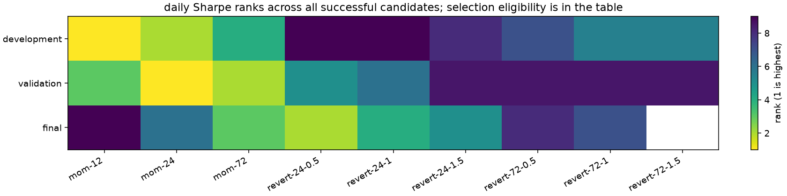

# SYN

i ran 9 settings and two baselines across 5 scenarios on made-up prices. 0 of 55 runs failed. [every result](all-results.csv) stays in the report.

these are software checks, not market findings.

## the three parts

| part | observed days / sessions | eligible settings | positive gross → positive net | pick: annual mean | median setting: annual mean | pick: Sharpe | pick rank | entries |
| --- | ---: | ---: | --- | ---: | ---: | ---: | ---: | ---: |
| development | 10 | 1 | 3 → 3 | 229.644% | -16.823% | 25.047 | 1 | 3 |
| validation | 10 | 3 | 3 → 3 | 23.577% | -132.846% | 5.203 | 2 | 7 |
| historical_final | 10 | 6 | 8 → 8 | 17.845% | 12.523% | 5.359 | 6 | 14 |

annual mean is mean daily P&L / stated capital, scaled by the declared observations per year. it isn't CAGR. the median is across all successful candidates, including those below the selection trade threshold; it isn't a traded portfolio.

## all settings at base assumptions

| setting | development annual mean | validation annual mean | final annual mean |
| --- | ---: | ---: | ---: |
| mom-12 | 229.644% | 23.577% | 17.845% |
| mom-24 | 211.955% | 33.610% | 34.053% |
| mom-72 | 102.659% | 27.835% | 50.471% |
| revert-24-0.5 | -48.127% | -127.512% | 16.163% |
| revert-24-1 | -48.127% | -132.846% | 12.523% |
| revert-24-1.5 | -44.023% | -137.675% | 9.330% |
| revert-72-0.5 | -23.470% | -137.675% | 5.982% |
| revert-72-1 | -16.823% | -137.675% | 4.450% |
| revert-72-1.5 | -10.215% | -137.675% | 0.000% |
| flat | 0.000% | 0.000% | 0.000% |
| always_long | 185.118% | -88.059% | 52.581% |

## what changed under stress

| part | scenario | comparison | annual mean change from base | gross $ change | fill change |
| --- | --- | --- | ---: | ---: | ---: |
| development | gross_reference | cost only | 1.642% | 0.00 | 0 |
| development | higher_cost | cost only | -1.643% | 0.00 | 0 |
| development | one_bar_late | delay only | 3.214% | 88.05 | 0 |
| development | combined_stress | combined cost and delay | 1.571% | 88.05 | 0 |
| validation | gross_reference | cost only | 3.832% | 0.00 | 0 |
| validation | higher_cost | cost only | -3.832% | 0.00 | 0 |
| validation | one_bar_late | delay only | 9.061% | 248.25 | 0 |
| validation | combined_stress | combined cost and delay | 5.229% | 248.25 | 0 |
| historical_final | gross_reference | cost only | 7.665% | 0.00 | 0 |
| historical_final | higher_cost | cost only | -7.665% | 0.00 | 0 |
| historical_final | one_bar_late | delay only | -8.730% | -239.19 | 0 |
| historical_final | combined_stress | combined cost and delay | -16.395% | -239.19 | 0 |

cost-only cases keep the delay fixed; delay-only cases keep cost rates fixed. delay can help by chance. these are assumed fills from OHLCV, not measured spreads or actual orders.

## how uncertain it is

| part | comparison | block length | annual mean difference | 95% interval |
| --- | --- | ---: | ---: | --- |
| validation | pick − flat | 3 | 23.577% | -15.294% to 80.488% |
| validation | pick − flat | 5 | 23.577% | -13.673% to 59.401% |
| validation | pick − flat | 10 | 23.577% | 23.577% to 23.577% |
| validation | pick − always_long | 3 | 111.636% | -22.058% to 251.783% |
| validation | pick − always_long | 5 | 111.636% | -19.472% to 244.075% |
| validation | pick − always_long | 10 | 111.636% | 111.636% to 111.636% |
| historical_final | pick − flat | 3 | 17.845% | -15.754% to 46.914% |
| historical_final | pick − flat | 5 | 17.845% | 0.533% to 35.156% |
| historical_final | pick − flat | 10 | 17.845% | 17.845% to 17.845% |
| historical_final | pick − always_long | 3 | -34.736% | -74.119% to -0.429% |
| historical_final | pick − always_long | 5 | -34.736% | -66.399% to -1.880% |
| historical_final | pick − always_long | 10 | -34.736% | -34.736% to -34.736% |

paired circular blocks keep the two strategies on the same days. i use the declared 3/5/10 lengths, 2,000 draws and seed 1729. these are descriptive intervals. serial dependence beyond those blocks, regime changes, prior knowledge and selection remain limits.

## rank changes and yearly selections

- development vs validation: Spearman None, on 1 settings eligible in both parts.
- development vs historical_final: Spearman None, on 1 settings eligible in both parts.

walk-forward below selects on the prior three calendar years. it inspects an already continuously simulated candidate in the next year. it doesn't execute a switching portfolio, charge switching costs or reset inventory at the year boundary.

| next year | selected setting | train Sharpe | next-year Sharpe | next-year days |
| --- | --- | ---: | ---: | ---: |

## assumptions i kept

one futures contract or flat, price-difference P&L times the multiplier. roll instructions need independent advance evidence. daily marks miss intraday drawdown. exposure counts observed sampled marks, not elapsed trading time.

protocol: `d7dea6e6279ade08ef4fdac30deeba7c8daa77b43aeabc78ddd06477e89ee083`. source: `0a38e629623fca6bb2afc58a0ec353d632a4af01983976701ece1d87cbef454d`.

execution: `3f9a57f2eb2e8dc6ce08fad2a807fc3c5b2f8b1f46a354514b75175092fe9184`. the saved manifest records code, actual callables, inputs and dependencies.

## two smaller checks

i repeated a noise experiment 100 times, with 40 candidates in each run and no expected edge. the median selected development Sharpe was 2.26; the same picks scored -0.01 on later noise. the median across all development candidates was -0.04. the JSON keeps every selected score.

i also bought at 100 and sold at 100.25 with a $20 multiplier. that made $5.00 gross, but lost $10.00 after both sides' costs.
